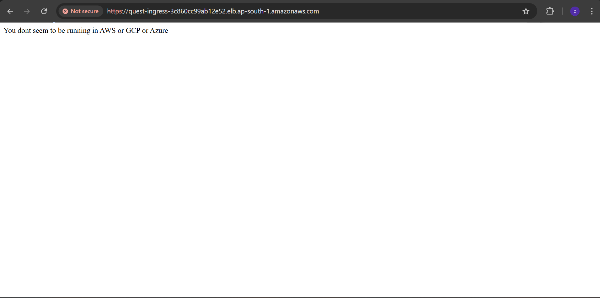
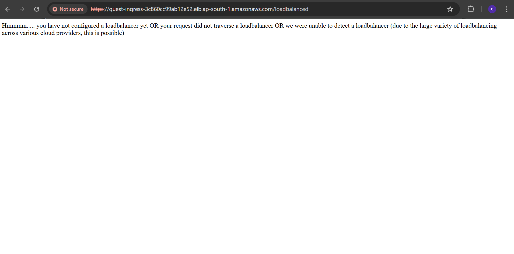
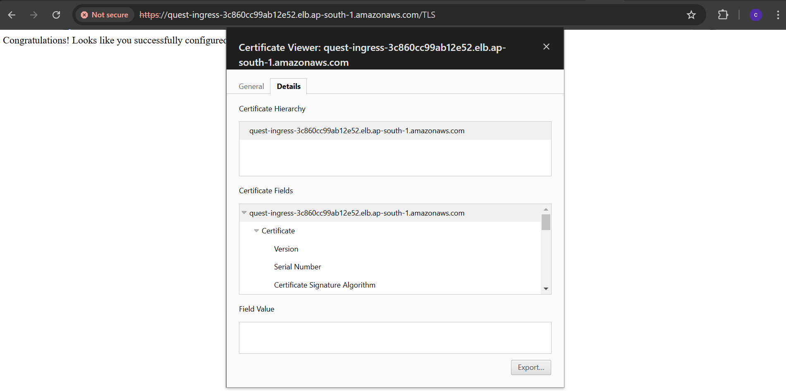
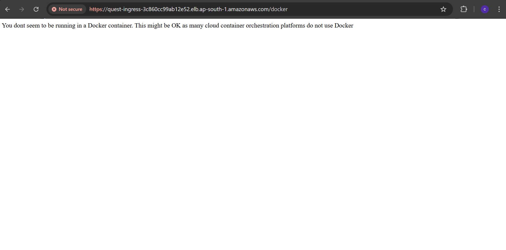
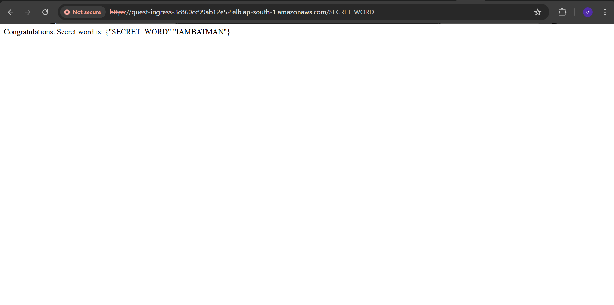

# Quest Solution

## Overview

This Solution is a Kubernetes-based deployment solution managed via Terraform, ArgoCD and Github-Actions. 

## Tools Used
- **Cloud Provider**: AWS
  - *VPC*: Containes pulic and private subnets in multi az with NAT. 
  - *EKS*: Eks cluster with eks managed node group with pod-identity-agent addon.
  - *IAM*: Roles and Policies for different resource.
  - *ECR*: Managing container images
- **K8s**
  - *LB-controller*: Managing elb for eks-services
  - *Ingress-nginx*: Ingress for services
  - *Secret-csi-driver*: For mounting secret-manager sercrets to the pod
  - *Cert-manager*: For issuing tls certificate
- **ArgoCD Integration**: Automates application deployment.
- **Terraform Deployment**: Infrastructure-as-Code (IaC) automation.
- **Github-Actions**: For infra provisioing and app deployment.
- **k9s**: For easily accessing, monitoring and managing k8s resources.

---
## IaC with Terraform

Terraform is used with S3 backend for managing the infra. Its written in the modulerized manner to provision and manage different components separately.

### Terraform resources

- VPC with 3 AZs
    - Public subnets
    - Private subnets
    - NAT gateways
    - Internet gateway
- EKS
    - eks managed node group
    - pod-idenitity-agent addon for assigning iam role for pods
    - eks access entry for accessing the cluster via kubectl
    - Load-balancer controller for managing load balancer for k8s service.
    - Ingress-nginx for creating ingress, path based routing, tls for different services.
    - Secret-csi-driver to mount the secrets as volumes in the pods.
    - Secrets-store-csi-driver-provider-aws to fetch the secrets from the aws secret manager.
    - ArgoCD installed with loadbalancer service for deploying the application.
    - Certmanager with self-signed clusterissuer to create self-signed tls cert for the ingress-nginx loadbalancer dns name cause not using any Domain name for pointing to lb dns name.

---
## CI/CD with Github Actions
Github-Actions is used for provisioning the infra as well as deploying the application.

There are two workflows infra.yaml and deploy.yaml.

---
### GitHub Actions Workflow for Infrastructure Provisioning

This GitHub Actions workflow provides an **on-demand infrastructure provisioning** mechanism using **Terraform**. It allows to manually trigger the workflow via **workflow_dispatch** and choose the specific infrastructure component to deploy.

#### 🚀 **How It Works**
- The workflow supports **manual triggering** via GitHub UI.
- Users select a **service name** (e.g., `vpc`, `eks`, `lb-controller`, etc.).
- Users choose an **action** (`plan`, `apply`, or `destroy`).
- Terraform is executed on the selected service.

#### 📌 **Workflow Inputs**
| Input | Description | Options |
|-------|------------|---------|
| `service_name` | Select the infrastructure component to provision | `vpc`, `eks`, `lb-controller`, `ingress-nginx`, `secret-csi-driver`, `argocd` |
| `action` | Choose Terraform action to perform | `plan`, `apply -auto-approve`, `destroy -auto-approve` |

#### ⚙️ **Workflow Steps**
1. **Checkout Code** – Pulls the repository.
2. **Configure AWS Credentials** – Uses GitHub Secrets for authentication.
3. **Setup Terraform** – Installs Terraform.
4. **Initialize Terraform** – Runs `terraform init` in the selected directory.
5. **Execute Terraform Command** – Runs `terraform plan`, `terraform apply`, or `terraform destroy` based on user input.

#### 🛠 **Environment Variables & Secrets**
- `AWS_ACCESS_KEY_ID`
- `AWS_SECRET_ACCESS_KEY`
- `AWS_REGION`

---
### 🚀 Build, Push, and Deploy Workflow

This **GitHub Actions workflow** automates the process of **building a Docker image, pushing it to AWS ECR, and updating the Kubernetes deployment in ArgoCD**. The workflow is triggered on **push events to the `main` branch** or via **manual dispatch**.

#### 📌 **Workflow Triggers**
| Trigger | Description |
|---------|------------|
| `push` | Runs automatically when changes are pushed to the `main` branch under the `quest/` directory. |
| `workflow_dispatch` | Allows manual triggering via GitHub UI. |

#### 🔧 **Workflow Steps**
#### **1️⃣ Build and Push Docker Image**
- Checks out the repository.
- Prints the GitHub commit SHA (`GITHUB_SHA`).
- Logs into **AWS Elastic Container Registry (ECR)** using GitHub Secrets.
- Builds and pushes a **Docker image** tagged with `${GITHUB_SHA}`.

#### **2️⃣ Update Kubernetes Manifests**
- Updates the `kustomization.yaml` file in `k8s/quest-kustomize/` to set `newTag` to `${GITHUB_SHA}`.

#### **3️⃣ Commit and Push Changes**
- Commits and pushes the updated `kustomization.yaml` file back to the repository.
- ArgoCD will detect the change and **automatically deploy the new image**.

#### 🔑 **Environment Variables & Secrets**
| Secret | Description |
|--------|-------------|
| `ECR_REPO` | AWS Elastic Container Registry (ECR) repository URL. |
| `AWS_ACCESS_KEY_ID` | AWS credentials for authentication. |
| `AWS_SECRET_ACCESS_KEY` | AWS secret key for authentication. |

---
### EKS OUTPUT
---
While running in eks application is not able to verify the AWS platform.

Its not able to detect the load-balancer because service is exposed via ingress-nginx.

Self signed cert is created for ingress service lb dns name.

Not able to detect docker because of containerd runtime.

secret word output.
